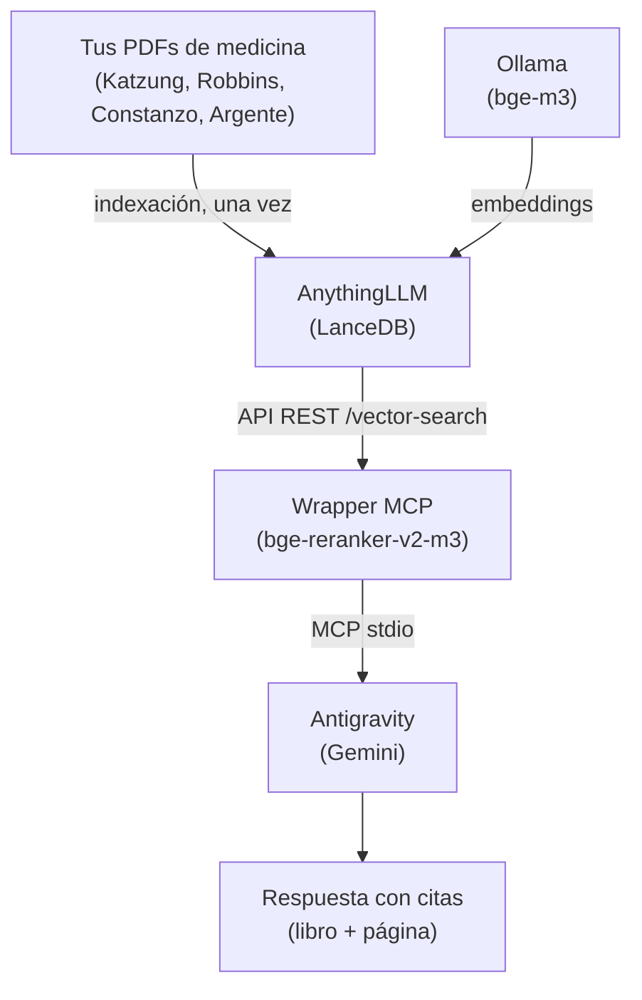

# MCP AnythingLLM

> Puente MCP entre tus libros indexados en AnythingLLM y Google Antigravity,
> con reranking multilingüe y citas verificables.

Un experimento personal que funciona. No es un producto, no promete nada.
Simplemente resolvió un problema que yo tenía, y quizás a ti también te sirva.

## Sobre este proyecto

Este es un **proyecto personal**, hecho por un estudiante de medicina (no por
un programador) como solución a un problema concreto: estudiar con libros de
texto completos era lento, y usar un LLM para consultarlos consumía cuota
masivamente.

**Sobre el soporte:** intentaré ayudar en la medida de lo posible, pero no
puedo prometer tiempos de respuesta ni garantizar que funcione en todos los
sistemas. Si algo no funciona en tu máquina, abre un issue describiendo el
problema con el mayor contexto posible — si tengo tiempo, te ayudo. Si no,
puede que otro usuario de la comunidad lo haga.

**Sobre la licencia:** el código es **libre** bajo **AGPL-3.0-or-later**.
Puedes usarlo, modificarlo, y redistribuirlo libremente. La única condición
es que si haces cambios y los distribuyes (incluyendo ofrecerlo como servicio
web), debes compartir tus cambios bajo la misma licencia. Esto protege al
proyecto de que alguien lo cierre y lo convierta en un producto privado, pero
te deja a ti toda la libertad para adaptarlo a tu caso.

## El problema que resuelve

Estudiar medicina con libros de texto completos (Katzung, Robbins, Constanzo,
Argente) es lento: encontrar un dato específico en un capítulo de 60 páginas
toma minutos. Los LLMs modernos pueden ayudarte, pero **leer libros enteros en
un asistente como Gemini, Claude u OpenAI consume cuota masivamente** 
— el demo oficial del OS de Google usó 2.6B tokens y costó ~$917 en una sola tarea.

**La solución:** un RAG local que indexe tus PDFs en tu propia pc
(privacidad total y sobre todo, 0 coste de indexación) y exponga búsqueda
semántica a Antigravity vía MCP. Solo los fragmentos relevantes se envían al
modelo, con citas de libro y página exactas.

Este proyecto es **el puente que faltaba** entre AnythingLLM (que indexa y
busca) y Antigravity (que razona y genera respuestas).

## Qué hace

- **Búsqueda multi-workspace** — expone varios dominios médicos como
  herramientas MCP independientes (ciencias básicas, fisiología, patología,
  propedéutica, farmacología o cualquiera que desees añadir)
- **Reranking multilingüe** — consulta en español sobre libros en inglés
  gracias a `BAAI/bge-reranker-v2-m3`
- **Citas verificables** — cada fragmento incluye libro, página y score
  de relevancia del reranker
- **100% local para indexación** — tus PDFs nunca salen de tu máquina
- **Coste mínimo de tokens** — cada consulta envía ~6-8 fragmentos en
  lugar de libros completos, ahorrándote una cantidad considerable de tokens
- **Compatible con cualquier cliente MCP** — Antigravity, Claude Code,
  Cursor, etc.

## Arquitectura


**Aclaración:** Ollama solo se usa para **generar embeddings durante la
indexación**. En las consultas no actúa. El único que genera texto es Gemini
(o el modelo que elijas) dentro de Antigravity

---

## Requisitos

| Componente | Mínimo | Recomendado |
|-----------|--------|-------------|
| RAM | 16 GB | 24 GB |
| Disco | 10 GB libres | 20 GB |
| GPU | No necesaria | NVIDIA (para embeddings más rápidos) |

**Sistema operativo:**
- Fedora 42+ / Ubuntu 22.04+ / Arch
- macOS 12+ (Apple Silicon)

**Software:**
- [Ollama](https://ollama.com/) — runtime de modelos locales
- [AnythingLLM](https://anythingllm.com/) — indexador y motor RAG
- [Google Antigravity](https://antigravity.google/) — cliente agente
- [uv](https://docs.astral.sh/uv/) — gestor de paquetes Python

---

## Instalación rápida
## Instalación

### Opción A — Instalador automatizado (recomendado)

```bash
git clone https://github.com/ivanpaguay13/mcp-anythingllm.git
cd mcp-anythingllm
./install.sh
```
El instalador funciona en dos fases:

- **Fase 1** (`./install.sh`): instala Ollama, uv, las dependencias Python
  y descarga los modelos (`bge-m3` + `bge-reranker-v2-m3`).
- **Fase 2** (`./install.sh --configure`): configura Antigravity con tu
  API key. Se ejecuta cuando ya tienes AnythingLLM instalado y funcionando.

Al terminar la Fase 1, el script muestra los pasos manuales que faltan
(instalar AnythingLLM, crear workspaces, subir PDFs, obtener la API key).

### Opción B — Instalación manual

Si prefieres hacerlo todo a mano paso por paso, ver **[docs/INSTALL.md](docs/INSTALL.md)**.
---
## Notas sobre el instalador

- **Se ejecuta con bash**, no con el shell del usuario. Aunque tú uses zsh
  (macOS) o fish, el script siempre corre con bash. Funciona en bash 3.2+,
  que es la versión que trae macOS por defecto.

- **No instala AnythingLLM.** Esa aplicación requiere interacción gráfica
  (AppImage, `.dmg` o instalador oficial) y no se puede automatizar sin
  comprometer la seguridad. El instalador te indica cuándo instalarlo.

- **No sube tus PDFs.** La indexación es una operación de UI en AnythingLLM
  y requiere tus decisiones (qué libros, en qué workspace, etc.).

- **Idempotente**: se puede ejecutar varias veces sin romper nada. Detecta
  lo que ya está instalado y no lo reinstala.

- **Solo pide `sudo` para lo necesario**: instalar paquetes del sistema
  (dnf/apt/pacman) y configurar Ollama como servicio systemd. Todo lo demás
  corre con tu usuario normal.

---
## Uso

Una vez configurado, Antigravity usará automáticamente las herramientas
cuando preguntes sobre medicina.

### Ejemplo 1 — Consulta simple

> ¿Qué dice Katzung sobre los inhibidores de SGLT2?

Antigravity llama a `buscar_farmacologia`, obtiene fragmentos del Katzung
con citas exactas, y responde con la información y las páginas.

### Ejemplo 2 — Consulta multi-workspace

> Explícame la insuficiencia cardíaca: fisiología, patología, clínica y
> tratamiento farmacológico.

Antigravity llama a `buscar_fisiologia`, `buscar_patologia`,
`buscar_propedeutica` y `buscar_farmacologia`, y sintetiza una respuesta
integrada con citas de los cuatro dominios.

### Ejemplo 3 — Consulta dirigida

> Solo del Robbins, ¿qué dice sobre la patogenia de la aterosclerosis?

Antigravity llama a `buscar_patologia` y filtra los fragmentos que no son
del Robbins antes de responder.

---

## Documentación

- **[docs/INSTALL.md](docs/INSTALL.md)** — guía completa de instalación
- **[docs/TROUBLESHOOTING.md](docs/TROUBLESHOOTING.md)** — errores comunes
  y sus soluciones
- **[docs/AGENTS.md.example](docs/AGENTS.md.example)** — ejemplo de reglas
  para que Antigravity use las herramientas correctamente

---

## Estado del proyecto

**Funciona y es usable, pero es joven.** Lo que significa:

- Probado en Fedora 44 con Ryzen 7 y 24 GB de RAM
- Instalador automatizado probado en Fedora 44 (VM limpia)
- Teóricamente compatible con Ubuntu, Arch y MacOS (bash 3.2+), sin probar
- Sin tests automatizados todavía
- Sin instalador gráfico (por ahora, es un CLI)

---

## Roadmap

- [x] Reranking con `bge-reranker-v2-m3`
- [x] Soporte para múltiples workspaces
- [x] Consultas multi-workspace en una sola conversación
- [x] Script de instalación automatizado
- [ ] Soporte para Anki vía MCP
- [ ] Filtro por libro específico en las consultas
- [ ] Verificación en macOS con Apple Silicon
- [ ] Traducción al inglés del README

---

## Cómo contribuir

Este proyecto nació como una solución personal y sigue siendo pequeño. Si te
sirve y quieres mejorarlo, las áreas donde más ayuda hace falta son:

- **Reportar errores** — abre un issue con tu distro, versión de Ollama,
  y el mensaje de error completo
- **Port a macOS** — necesitamos testers con Apple Silicon
- **Traducción al inglés** del README y docs
- **Nuevos MCP servers** — Anki, Zotero, lo que necesites

Abre un issue **antes** de trabajar en algo grande, para evitar duplicación.

---

## Licencia

El código está licenciado bajo **AGPL-3.0-or-later**. Ver [LICENSE](LICENSE).

La documentación (`README.md`, `docs/*.md`) está licenciada bajo
**CC BY-SA 4.0**.

En términos simples: puedes usar, modificar y redistribuir libremente, pero
si haces cambios debes compartirlos bajo la misma licencia. Esto incluye
casos donde ofrezcas el software como servicio web.

---

## Agradecimientos

Este proyecto se apoya en el trabajo de:

- [BAAI / FlagEmbedding](https://github.com/FlagOpen/FlagEmbedding) — modelos
  `bge-m3` y `bge-reranker-v2-m3`
- [AnythingLLM](https://github.com/Mintplex-Labs/anything-llm) — motor RAG
  con interfaz gráfica
- [Ollama](https://github.com/ollama/ollama) — runtime local de modelos
- [Anthropic](https://github.com/modelcontextprotocol) — protocolo MCP
- [Google Antigravity](https://antigravity.google/) — cliente agente

Y a las comunidades de Fedora, Python y MCP por la documentación dispersa
que hizo posible armar esto.
